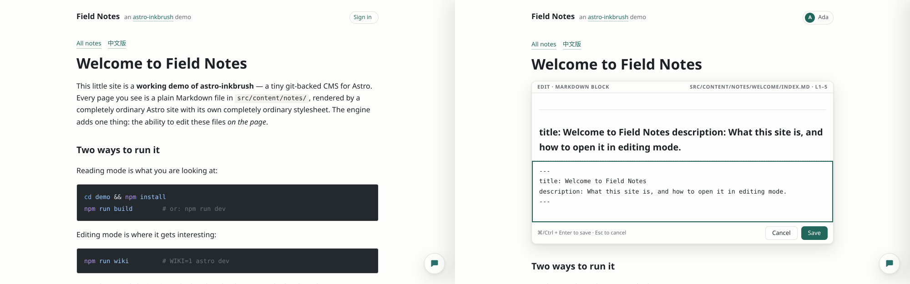

<h1 align="center">astro-inkbrush</h1>

<p align="center"><b>给 Astro 的极小 git-backed CMS——在页面上原地编辑你的静态站。</b></p>

<p align="center">
  <a href="https://github.com/ventusff/astro-inkbrush/actions/workflows/ci.yml"></a>
  <a href="LICENSE"></a>
  
</p>

<p align="center">
  <a href="https://ventusff.github.io/astro-inkbrush/"><b>在线示范笔记站&nbsp;→</b></a>
  &nbsp;·&nbsp;
  <a href="docs/manual.zh-CN.md">使用手册</a>
  &nbsp;·&nbsp;
  <a href="README.md">English</a>
</p>

<p align="center">
  
</p>

**Inkbrush(笔)**给任意 Astro 站点叠加一层可选的编辑能力:鼠标悬到某个段落,
点 ✎,原地改 Markdown 源码,保存——页面热更新,开了 `autocommit` 的话改动即一次
git 提交。没有数据库、没有管理后台、没有独立的写作应用。内容文件始终是唯一
事实源,git 始终是历史。

它与 [**astro-inkstone**](https://github.com/ventusff/astro-inkstone)(砚)是
姊妹项目——一个纸墨质感的设计层。Inkbrush 只给自己的编辑 chrome 上样式(颜色
取自你页面的 token),不带任何页面样式与布局:接到你自己的站上用,或与
Inkstone 配套获得完整观感。

## 特性

- ✏️ **原地块编辑** —— Wikipedia 式逐块编辑。CodeMirror 6、跑着你站点自己
  Markdown 插件的服务端实时预览、`[[` 自动补全、乐观锁(别人改过的块会被
  拒绝,绝不覆盖),保存前先过整文件构建关——方言、内容守门、你的插件、
  MDX 编译——过不了就一个字节也不写。
- 🕘 **块级修订史** —— 每次保存入账、各有唯一 id;逐块查看历史,块级改动
  一键回滚(导入、翻译这类整文件操作只入账备查,回滚走 git)。
- 🤖 **AI 协作** —— 改写某个块、就当前笔记提问、一键生成整篇笔记的另一语言
  版——经 `claude` CLI,进度实时流式展示。每个任务都在一份只含这篇笔记
  (以及你配置里点名的伴随文件)的临时工作副本里跑,文件工具被限制在副本内、
  没有 shell 与网络工具、环境变量按白名单给;结果先像手工保存一样过校验,
  而且只有任务期间没人动过这批文件才搬回项目——并发的手工编辑永远赢。
- 💬 **评论区** —— Markdown + 数学公式,服务端消毒,以 NDJSON 平文件存放在
  项目旁的 `.wiki/data/` 下;作者邮箱永不出服务端。
- 📥 **Obsidian 收件箱** —— 监听 vault 目录;新笔记自动转换导入(附件复制到
  笔记同目录、用相对路径引用,双链用页面同一套解析器解析,高亮保留)。
- 🔗 **双链** —— 一份 `[[wikilink]]` 实现,页面管线、编辑器预览、导入器三处
  共用:别名、锚点、语言镜像,解析不到时渲染死链标记而不是弄红构建。
- 🔐 **登录方式** —— 本地快速登录(默认只服务本机)、Google OAuth(PKCE、
  绑定浏览器的一次性 state)、Google Workspace SAML SSO(每个响应都必须对应
  本服务发出的请求);域名白名单一律默认拒绝;
  HMAC cookie 或 JWT 会话(可跨子域 SSO);可选的文件式成员注册表——开启后
  只有在册成员能编辑,只有管理员能管理名单。
- 📤 **密码门控分享** —— 把单篇笔记连同全部资源快照成静态包,经一个
  一下午就能实现的小网关 API 对外发布。
- 🧾 **有底线的 Markdown 方言** —— GFM + CJK 友好的强调解析,一处定义、
  三处共用(页面渲染、保存校验、编辑器预览);外加构建期**内容守门**:
  凡「写的和渲染的不一致」的静默变形——配不上对的 `*` `_` `~~`、吃掉正文的
  MDX 表达式、单行 `$$x$$`、KaTeX 渲不出的公式等——一律构建失败,
  精确到 file:line:column 并画出插标。
- 🩺 **检查 CLI** —— `check-content.mjs`(用方言、守门、以及传入 `--config`
  时你站点的插件真编译每个源文件)、`check-wikilinks.mjs`(死链或多义的
  `[[双链]]`、可疑锚点——解析器与解析规则直接取自库本体)与 `check-dist.mjs`
  (构建产物的死链、悬空锚点、语言段重复、`<a>` 嵌套、KaTeX 报错残留,以及
  任何 CMS 注入痕迹)。
- 🪶 **生产构建零残留** —— 本集成在 `astro dev` 之外什么都不做,
  `check-dist` 会让带了它任何字节的构建失败。

## 工作方式

```
读者   →  静态构建产物(astro build)——nginx、Pages、对象存储……
作者   →  同一个仓在编辑域名上跑 `WIKI=1 astro dev`
           └─ 保存 → git 提交(autocommit)→ 推送(autopush)→ CI 重建静态站
```

编辑器就是开着本集成的 Astro dev server:「改完即生效」的编辑面需要一个常驻的
编译器,dev server 恰好就是。会话、成员注册表与跨站请求检查让它配得上真实域名;
面向读者的站点永远不运行其中任何代码。双服务部署骨架(静态读者站 + 编辑机)
在本仓的 [`deploy/`](deploy/README.md)。

## 快速开始

跑起示范站——一个接好编辑器的多笔记小站:

```bash
git clone https://github.com/ventusff/astro-inkbrush
cd astro-inkbrush && npm install
cd demo && npm install
npm run wiki        # WIKI=1 astro dev → 打开站点,登录(本地登录),开始编辑
npm run build       # 阅读模式——顺便验证零残留
```

## 接入你的站点

三处改动,全部由一个环境变量把关(以 git submodule 引入本仓,依赖声明用
pnpm `workspace:*` 或 npm `file:`——本包按设计不发 npm):

```ts
// astro.config.ts
import { inkbrush, rehypeWikiBlocks } from 'astro-inkbrush';
import { markdownProcessor } from 'astro-inkbrush/markdown';

const WIKI_MODE = Boolean(process.env.WIKI);

const remarkPlugins = [/* 站点自己的 */];
const rehypePlugins = [/* 站点自己的 */];

export default defineConfig({
  markdown: {
    processor: markdownProcessor({
      remarkPlugins,
      rehypePlugins: [...rehypePlugins, ...(WIKI_MODE ? [rehypeWikiBlocks] : [])],
    }),
  },
  // 同一份插件交给 CMS:预览与保存校验就和页面渲染一模一样
  integrations: [...(WIKI_MODE ? [inkbrush({ markdown: { remarkPlugins, rehypePlugins } })] : [])],
});
```

```astro
<!-- 每个笔记页:告诉 CMS 这一页对应哪个笔记(路由完全归站点) -->
<meta name="inkbrush-note" content={noteId} />
```

```bash
cp <本包检出路径>/inkbrush.config.example.ts inkbrush.config.ts   # 可选,按机器配置
WIKI=1 astro dev
```

不写配置文件也能跑——默认只开本地登录,其余全关。登录方式、成员注册表、
收件箱、分享与全部配置项见[使用手册](docs/manual.zh-CN.md)。

## 三者分工

```
astro-inkbrush   笔——编辑:块级 CMS、修订史、评论、AI、收件箱、
                 Markdown 方言与内容守门
astro-inkstone   砚——观感:token、内容样式、组件、管线预设
                 (预设建立在本包方言之上)
你的站点         手——身份:布局、路由、内容、部署
```

Inkbrush 在 CMS 之外唯一多管的一件事是 **Markdown 方言**——编辑器接受的块
必须和页面渲染的一模一样,所以解析规则只在一处定义、处处共用。

## 许可

[MIT](LICENSE) © Jianfei Guo
